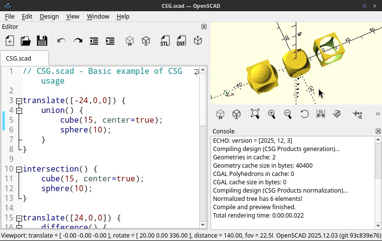

# docker-openscad
This repository collects OpenSCAD related docker files. One is meant for running OpenSCAD in a container (for building models, etc.), while the rest are meant for internal use in the OpenSCAD CI automation.

## General Use

For general use (running OpenSCAD in a container), please use the `openscad/openscad` images published and documented at Docker Hub.

* [openscad/openscad](https://hub.docker.com/repository/docker/openscad/openscad)

### Rendering to a STL/3MF Model

```bash
docker run \
    -it \
    --rm \
    -v $(pwd):/openscad \
    -u $(id -u ${USER}):$(id -g ${USER}) \
    openscad/openscad:latest \
    openscad -o CSG.3mf CSG.scad
```

### Rendering a PNG

```bash
docker run \
    -it \
    --rm \
    --init \
    -v $(pwd):/openscad \
    -u $(id -u ${USER}):$(id -g ${USER}) \
    openscad/openscad:latest \
    xvfb-run -a openscad -o CSG.png CSG.scad
```

Note that PNG renderings currently still needs the X display. That limitation can go away soon due to the built-in EGL support. So this needs `--init` and run via `xvfb-run`.

## Web-based GUI (Selkies)

For running OpenSCAD with a full graphical interface accessible via web browser, use the Selkies-based image.



### Building

```bash
cd openscad/trixie-selkies
docker build --build-arg JOBS=$(nproc) -t openscad-selkies:trixie .
```

### Running

```bash
docker run -d \
    --name openscad-gui \
    -p 3000:3000 \
    -v $(pwd):/openscad \
    -v openscad-config:/config \
    openscad-selkies:trixie
```

Then open http://localhost:3000 in your web browser to access OpenSCAD.

To stop the container:
```bash
docker stop openscad-gui && docker rm openscad-gui
```

## CI support, for internal use

* `openscad/appimage-*`
* `openscad/mxe-*`
* `openscad/src-*`

All docker images can be viewed with a [Docker Hub search for `openscad/`](https://hub.docker.com/search?q=openscad%2F&image_filter=open_source&type=image).

## Debug Builds

Creating an image with debug symbols depends if the app is compiled with `cmake` or `qmake`. To enable debugging set `BUILD_TYPE="Debug"` and `DEBUG="+"` in `scripts/build-images.sh


Before
```bash
--build-arg BUILD_TYPE="Release" \
--build-arg DEBUG="-" \
```

After
```bash
--build-arg BUILD_TYPE="Debug" \
--build-arg DEBUG="+" \
```

Example to run gdb in a container
```bash
docker run --ulimit core=-1 -it -v $(pwd):/input openscad/openscad:2021.01-debug
apt update; apt install gdb -y
xvfb-run gdb --ex run --args openscad --info
```
